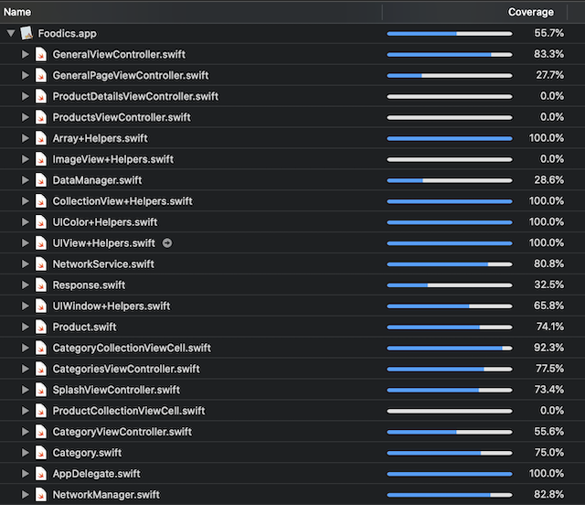

# Foodics

Project written in Swift 5 code 

### Prerequisites

Xcode 10.2
Swift 5

### Installing

Clone the porject.
Navigate to project folder in terminal.
install cocoapods

## Built With

* [Alamofire ]() - network layer
* [SwiftyJSON ]() - decode encode data
* [MBProgressHUD]() 
* [SDWebImage]() - cashe image
* [PromiseKit]() - used  as process chaining framework. It was used for api handling.

### Features:

unit test 

Data Persistence use NSKeyarchiver where I stored the response object to it matching api url

Error Handling use alerts + related to the first point

Design Patterns  Singleton for the api & data manager , facade in mbprogresshud & sd_webimage
